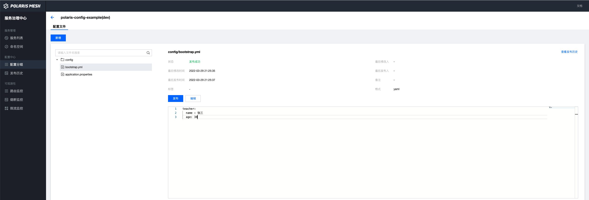

# Polaris Config Example 使用指南

## 1. bootstrap.yml 配置

修改 resources/bootstrap.yml ```spring.cloud.polaris.config.address``` 北极星服务端地址。
> 注意是在 bootstrap.yml 里配置，而不是在 application.yml 里配置。因为配置中心相关的配置是在 bootstrap 阶段依赖的配置。

```` yaml
spring:     
  application:
    name: polaris-config-example
  cloud:
    polaris:
      namespace: dev
      config:
        address: grpc://127.0.0.1:8093 # the address of polaris config server
        auto-refresh: true # auto refresh when config file changed
        groups:
          - name: ${spring.application.name} # group name
            files: [ "config/application.properties", "config/bootstrap.yml" ] # config/application.properties takes precedence over config/bootstrap.yml
````

## 2. 在北极星服务端创建配置文件

### 2.1 创建 namespace （dev）
### 2.2 创建配置文件分组（polaris-config-example）

北极星的配置文件分组概念为一组配置文件的集合，推荐应用名=分组名，例如在我们的示例中，新建一个 polaris-config-example 的分组。
把 polaris-config-example 应用的配置文件都放在 polaris-config-example 分组下，这样便于配置管理。

### 2.3 创建两个配置文件 config/application.properties 、config/bootstrap.yml

北极星配置中心的控制台，配置文件名可以通过 / 来按树状目录结构展示，通过树状结构可以清晰的管理配置文件。

#### 2.3.1 config/application.properties 文件内容
 
 ```` properties
timeout = 3000
````

#### 2.3.2 config/bootstrap.yml 文件内容

````yaml 
teacher:
  name : 张三
  age: 38
````            

页面样例如下图所示：



## 3. 运行 PolarisConfigExampleApplication

## 4. 访问接口

````
curl "http://localhost:48084/timeout"

curl "http://localhost:48084/person"
````

## 5. 动态推送能力

### 5.1 管控台动态修改并发布 config/application.properties

 ```` properties
timeout = 5000
````  

### 5.2 再次访问接口 
````
curl "http://localhost:48084/timeout"
````
 


