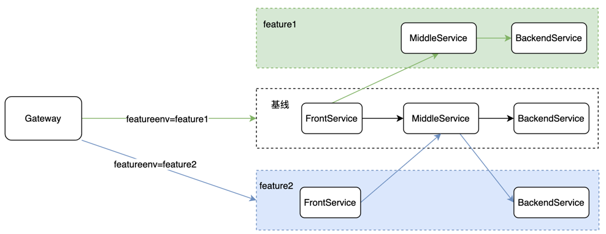

# 多测试环境样例说明

[English](./README.md) | 简体中文

## 一、部署结构



如上图所示，一共有三个环境：
1. 基线环境，包含 FrontService、MiddleService、BackendService
2. feature1 环境，包含 MiddleService、BackendService
3. feature2 环境，包含 FrontService、BackendService

并且在入口处，部署网关服务。

三条请求链路：
1. 基线环境链路，Gateway -> FrontService(基线) -> MiddleService(基线) -> BackendService(基线)
2. feature1 环境链路，Gateway -> FrontService(基线) -> MiddleService(feature1) -> BackendService(feature1)
3. feature2 环境链路，Gateway -> FrontService(feature2) -> MiddleService(基线) -> BackendService(feature2)


## 二、运行样例

无需任何代码变更，直接启动 base、feature1、feature2、featureenv-gateway 下所有应用即可。

应用默认指向北极星官方的体验环境，启动成功后可直接到体验站点查看服务注册数据。

- 管控台地址： http://14.116.241.63:8080/
    - 账号：polaris
    - 密码：polaris

## 三、测试

### 方式一：客户端打标

#### 基线环境链路
````
curl http://127.0.0.1:9999/featureenv-front-example/router/rest
````
响应结果（base 表示基线环境）
````
featureenv-front-example[base] -> featureenv-middle-example[base] -> featureenv-backend-example[base]
````

#### feature1 环境链路

通过 X-Polaris-Metadata-Transitive-featureenv 请求头指定特性环境。

````
curl -H'X-Polaris-Metadata-Transitive-featureenv:feature1' http://127.0.0.1:9999/featureenv-front-example/router/rest
````
响应结果
````
featureenv-front-example[base] -> featureenv-middle-example[feature1] -> featureenv-backend-example[feature1]
````

#### feature2 环境链路

通过 X-Polaris-Metadata-Transitive-featureenv 请求头指定特性环境。

````
curl -H'X-Polaris-Metadata-Transitive-featureenv:feature2' http://127.0.0.1:9999/featureenv-front-example/router/rest
````
响应结果
````
featureenv-front-example[feature2] -> featureenv-middle-example[base] -> featureenv-backend-example[feature2]
````

### 方式二：网关流量染色

模拟一种实际的场景，假设客户端请求有一个 uid 请求参数，期望:
1. uid=1000 的请求打到 feature1 环境
2. uid=2000 的请求打到 feature2 环境
3. 其它 uid 的请求打到基线环境
                           
**配置染色规则**

配置地址：http://14.116.241.63:8080/#/filegroup-detail?group=featureenv-gateway&namespace=default

修改 rule/staining.json 配置文件，填写以下规则:

````json
{
    "rules":[
        {
            "conditions":[
                {
                    "key":"${http.query.uid}",
                    "values":["1000"],
                    "operation":"EQUAL"
                }
            ],
            "labels":[
                {
                    "key":"featureenv",
                    "value":"feature1"
                }
            ]
        },
        {
            "conditions":[
                {
                    "key":"${http.query.uid}",
                    "values":["2000"],
                    "operation":"EQUAL"
                }
            ],
            "labels":[
                {
                    "key":"featureenv",
                    "value":"feature2"
                }
            ]
        }
    ]
}
````

填写完后发布配置即可。

#### 基线环境链路
````
curl http://127.0.0.1:9999/featureenv-front-example/router/rest?uid=3000
````
响应结果（base 表示基线环境）
````
featureenv-front-example[base] -> featureenv-middle-example[base] -> featureenv-backend-example[base]
````

#### feature1 环境链路

通过 X-Polaris-Metadata-Transitive-featureenv 请求头指定特性环境。

````
curl http://127.0.0.1:9999/featureenv-front-example/router/rest?uid=1000
````
响应结果
````
featureenv-front-example[base] -> featureenv-middle-example[feature1] -> featureenv-backend-example[feature1]
````

#### feature2 环境链路

通过 X-Polaris-Metadata-Transitive-featureenv 请求头指定特性环境。

````
curl http://127.0.0.1:9999/featureenv-front-example/router/rest?uid=2000
````
响应结果
````
featureenv-front-example[feature2] -> featureenv-middle-example[base] -> featureenv-backend-example[feature2]
````


